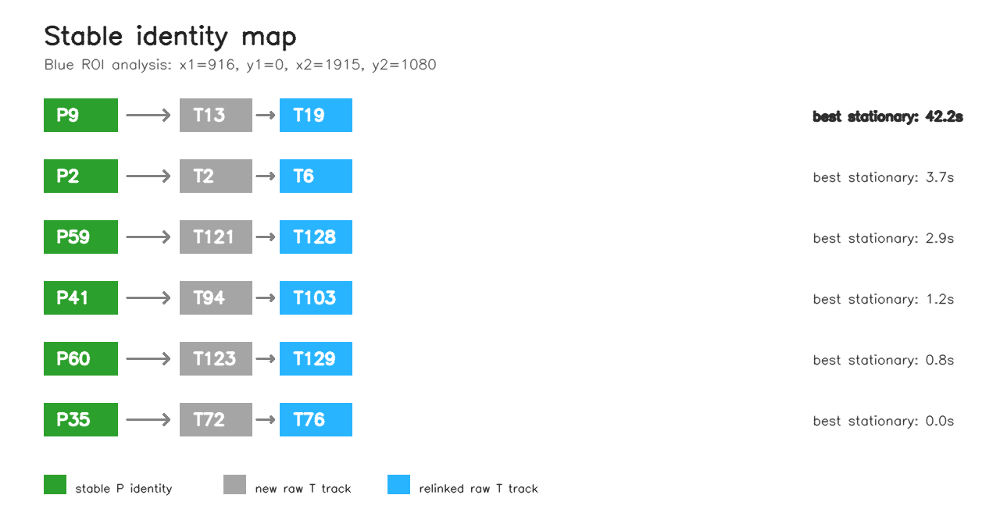
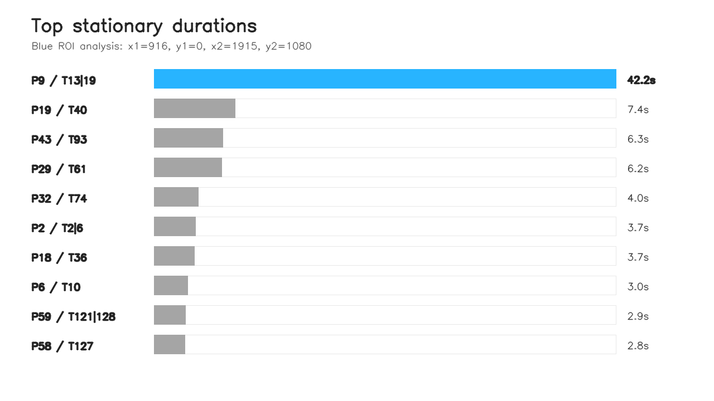
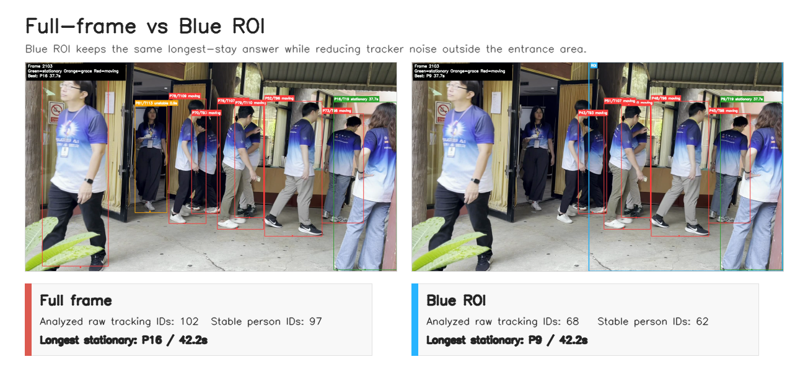
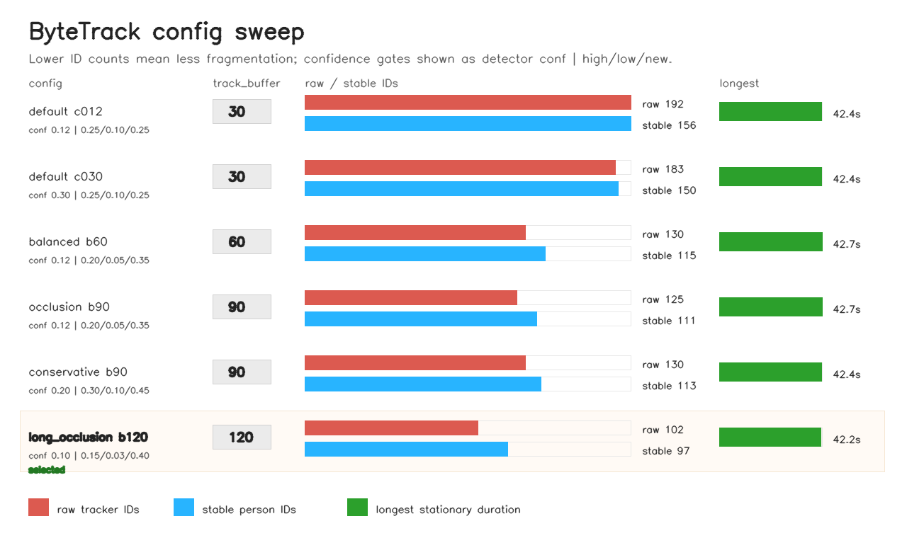

# Longest Stay Detection

This project finds the tracked person who stayed stationary for the longest duration in `entrance.mov`.

## Setup

```bash
python3 -m venv .venv
source .venv/bin/activate
pip install -r requirements.txt
```

## Run

```bash
python longest_stationary.py --video entrance.mov
```

By default, analysis is limited to the blue ROI shown in `assets/blue_roi_result.png`:

```text
x1=916, y1=0, x2=1915, y2=1080
```

The tracker still runs on the full frame, but only detections whose bottom-center
ground point falls inside the ROI are used for ReID and stationary-duration
scoring. To disable the ROI:

```bash
python longest_stationary.py --video entrance.mov --roi none
```

The blue ROI is necessary because the full frame contains people outside the
entrance area who are not relevant to the longest-stay question. Those extra
detections increase tracker noise and identity fragmentation. In the benchmark,
the blue ROI keeps the same longest stationary duration (`42.2s`) while reducing
analyzed raw tracker IDs from `102` to `68` and stable person IDs from `97` to
`62`.

The script writes:

- `outputs/annotated_entrance.mp4`: video with stable person IDs, raw tracker IDs, and stationary status
- `outputs/summary.json`: final answer and method details
- `outputs/longest_updates.csv`: log whenever a person creates a new longest stationary duration
- `outputs/reid_events.csv`: log of created and relinked identities
- `outputs/identity_tracks.csv`: stable person IDs and the raw tracker IDs merged into each one
- `outputs/longest_stay_strip.png`: sampled frame strip from the longest stationary interval
- `outputs/top_stationary_durations.png`: bar chart of the top stationary durations
- `outputs/identity_map.png`: chart showing which raw tracker IDs were merged into each stable person ID

To run with the optimized ByteTrack config from the sweep:

```bash
python longest_stationary.py \
  --video entrance.mov \
  --tracker tracker_configs/bytetrack_long_occlusion.yaml \
  --conf 0.10 \
  --output-dir outputs_best_bytetrack \
  --output-video annotated_entrance_best_bytetrack.mp4
```

To benchmark full-frame analysis against the blue ROI and generate a PNG chart:

```bash
python benchmark_roi.py --video entrance.mov --keep-videos
```

The benchmark writes `experiments/roi_benchmark/benchmark_results.csv`,
`experiments/roi_benchmark/benchmark_summary.json`,
`experiments/roi_benchmark/benchmark_roi.png`, and
`experiments/roi_benchmark/benchmark_roi_comparison.png`.

To customize or skip the longest-stay frame strip:

```bash
python longest_stationary.py --video entrance.mov --frame-strip-count 7
python longest_stationary.py --video entrance.mov --no-frame-strip
```

To customize or skip the top stationary durations chart:

```bash
python longest_stationary.py --video entrance.mov --duration-chart-count 10
python longest_stationary.py --video entrance.mov --no-duration-chart
```

To customize or skip the stable identity map:

```bash
python longest_stationary.py --video entrance.mov --identity-map-count 8
python longest_stationary.py --video entrance.mov --no-identity-map
```

## Result Images

The annotated overlays use green for stationary, orange for grace or unstable
tracks, and red for moving tracks. Labels use the format
`P<stable_person_id>/T<raw_tracker_id>`.

`T<raw_tracker_id>` is the raw ID assigned by ByteTrack to one continuous track
segment. It can change when a person is briefly lost, occluded, or re-detected.
`P<stable_person_id>` is the stable ID assigned by this project after custom
ReID. A single stable `P` can contain one or more raw `T` IDs.

When a new raw `T` appears, the script either creates a new stable `P` or links
that `T` back to a recently lost `P`. The relinking check compares bottom-center
position continuity, lower-body HSV color similarity, bbox-height ratio, and
time gap. For example, in the blue ROI run, `P9` contains `T13` and `T19`.
When the overlay later shows `P9/T19`, the current ByteTrack ID is `T19`, but
the stable person identity and stationary-duration score continue under `P9`.

| Stable identity map, blue ROI |
| --- |
|  |

| Longest-stay frame strip, blue ROI |
| --- |
|  |

| Top stationary durations, blue ROI |
| --- |
|  |

| Full-frame vs Blue ROI |
| --- |
|  |

| Blue ROI result | ROI benchmark |
| --- | --- |
|  |  |

The side-by-side frame shows why the ROI matters visually: full-frame tracking
keeps unrelated people on the left side of the image in the analysis, while the
blue ROI focuses scoring on the entrance area.

| ReID check frame 548 | ReID check frame 565 | ReID check frame 566 |
| --- | --- | --- |
|  |  |  |

The checked-in images under `assets/` are copies of generated artifacts. To
refresh them, rerun the corresponding command above and copy the regenerated
image into `assets/`.

## ByteTrack Sweep

Run the tracker-parameter sweep:

```bash
python optimize_bytetrack.py --video entrance.mov
```

The sweep writes:

- `experiments/bytetrack_optimization/experiment_results.csv`: one row per tracker setting
- `experiments/bytetrack_optimization/best_experiment.json`: selected setting by proxy objective
- `experiments/bytetrack_optimization/bytetrack_sweep.png`: visual comparison of tracking fragmentation and longest-stay duration

The logged columns include the number of stable person IDs, the number of raw tracking IDs, the longest-stay person ID, and that person's stationary duration.

| ByteTrack config sweep |
| --- |
|  |

The selected run uses detector `--conf 0.10` and
`tracker_configs/bytetrack_long_occlusion.yaml`:

```yaml
track_high_thresh: 0.15
track_low_thresh: 0.03
new_track_thresh: 0.40
track_buffer: 120
match_thresh: 0.90
```

This setting was chosen by a proxy objective: keep the longest-stay answer
within 95% of the best duration, then minimize tracking fragmentation. In the
sweep, `long_occlusion_buffer120` kept the longest stationary duration at
`42.2s` while reducing raw tracker IDs to `102` and stable person IDs to `97`.
The shorter default buffer configs produced `183-192` raw tracker IDs and
`150-156` stable person IDs.

The sweep varies two groups of tracking hyperparameters:

| Hyperparameter group | What it controls | Practical effect |
| --- | --- | --- |
| Detector `--conf` | Minimum YOLO confidence before detections are passed into tracking | Lower values keep weak person detections during motion blur or occlusion, but can add false positives. |
| `track_high_thresh` | Confidence level for strong detections used in the first ByteTrack association pass | Lower values make the tracker more willing to continue tracks with less confident detections. |
| `track_low_thresh` | Minimum confidence for low-score detections used in ByteTrack's recovery pass | Lower values help recover people after occlusion, but increase background/noise candidates. |
| `new_track_thresh` | Confidence required to start a new track | Higher values prevent weak detections from becoming new raw `T` IDs. |
| `track_buffer` | How long a lost track is kept before deletion | Larger values help reconnect people after short disappearance. |

`track_buffer` is the number of frames ByteTrack keeps a lost track alive before
deleting it. The video is about `29.88 FPS`, so:

| `track_buffer` | Approx. lost-track memory |
| --- | --- |
| `30` | `1.0s` |
| `60` | `2.0s` |
| `90` | `3.0s` |
| `120` | `4.0s` |

This matters in the doorway scene because people often overlap or disappear
briefly behind other people. A short buffer drops the track quickly, so the same
person can return as a new raw `T` ID. A longer buffer gives ByteTrack more time
to reconnect the same person after occlusion, reducing raw ID churn and the
number of stable `P` identities that the custom ReID layer must manage.

The tradeoff is that an overly long buffer can incorrectly reconnect two
different people in a crowd. This is why the selected long-occlusion config also
uses a stricter `match_thresh: 0.90` and why the blue ROI is important: it
reduces irrelevant candidates before ReID and stationary scoring.

Confidence score thresholds are necessary because this scene has both occlusion
and crowded motion. A high detector confidence such as `--conf 0.30` misses more
weak person detections, causing ByteTrack to terminate and restart tracks more
often. A lower detector confidence such as `--conf 0.10`, combined with
`track_low_thresh: 0.03`, gives ByteTrack low-score detections to bridge
occlusions. To prevent that from creating too many new false tracks, the
selected config keeps `new_track_thresh: 0.40`, so weak detections can help
continue existing tracks but cannot easily start new tracks.

## Method

1. Detect and track only `person` objects using Ultralytics YOLO with ByteTrack.
2. Map raw tracker IDs to stable person IDs. When a new raw tracker ID appears, compare it with recently lost stable IDs using:
   - bottom-center position continuity
   - lower-body/trouser HSV color histogram similarity
   - bbox-height ratio
   - time gap
3. Keep only tracks whose bottom-center point falls inside the configured ROI.
4. For each stable person ID, use the bottom-center point of the bounding box as the person's approximate ground position.
5. Smooth each point using an exponential moving average to reduce detector jitter.
6. Over a short recent time window, measure how far the smoothed points spread.
7. A person is stationary when that spread is below:

```text
max(min_stationary_px, stationary_ratio * bbox_height)
```

The bounding-box-height normalization helps account for perspective: people closer to the camera appear larger, so the same real-world movement creates larger pixel movement.

## Main Parameters

- `--window-seconds`: recent time window used to decide stationary status
- `--conf`: detector confidence threshold before detections are passed to ByteTrack
- `--tracker`: ByteTrack YAML config path
- `--smooth-alpha`: position smoothing factor
- `--stationary-ratio`: movement threshold relative to bbox height
- `--min-stationary-px`: minimum movement threshold in pixels
- `--grace-frames`: short tolerance before ending a stationary segment
- `--disable-reid`: turn off appearance-based relinking
- `--reid-score-threshold`: minimum weighted score for merging a new raw tracker ID into an existing stable person ID
- `--reid-min-color-score`: minimum trouser-color histogram similarity for relinking
- `--reid-max-gap-seconds`: maximum time gap allowed for relinking
- `--roi`: analysis ROI as `x1,y1,x2,y2`; use `none` for full-frame analysis

## Limitations

- The custom ReID logic reduces some tracker ID switches, but it can still fail when people have similar trousers, heavy occlusion, or strong lighting changes.
- Stationary movement is measured in image pixels, not real-world meters.
- The result depends on camera perspective, detection quality, threshold settings, and video resolution.
