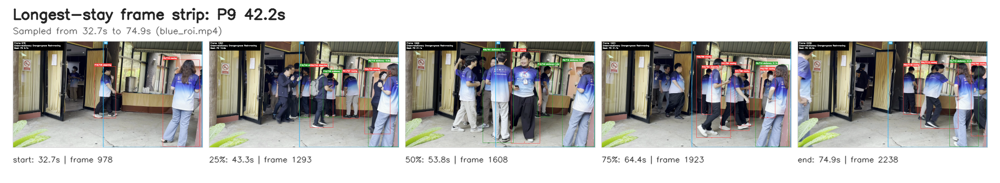
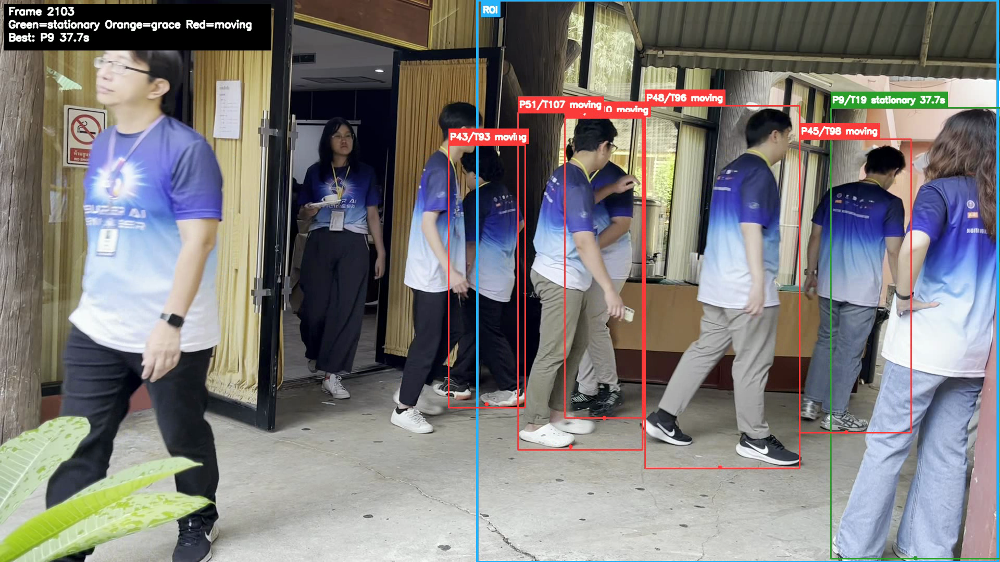
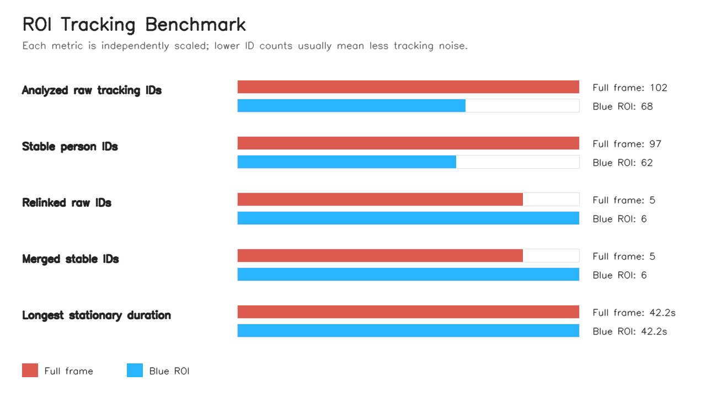
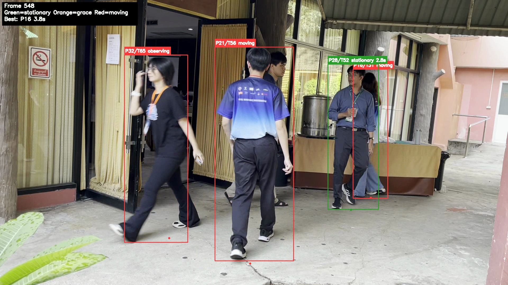
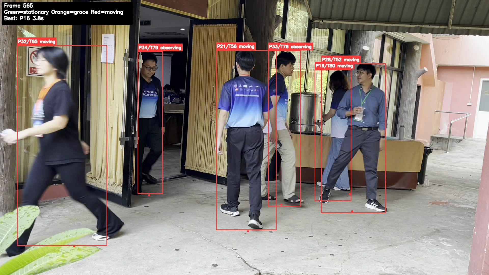
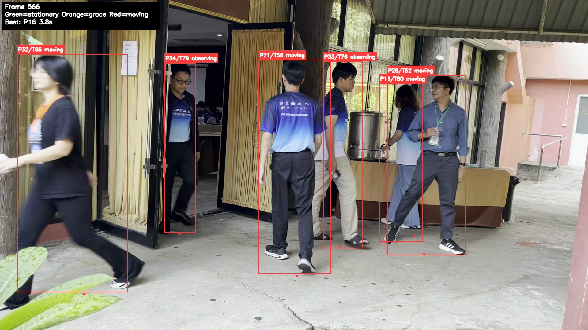

# Longest Stay Detection

This project finds the tracked person who stayed stationary for the longest duration in `entrance.mov`.

## Setup

```bash
python3 -m venv .venv
source .venv/bin/activate
pip install -r requirements.txt
```

## Run

```bash
python longest_stationary.py --video entrance.mov
```

By default, analysis is limited to the blue ROI shown in `assets/blue_roi_result.png`:

```text
x1=916, y1=0, x2=1915, y2=1080
```

The tracker still runs on the full frame, but only detections whose bottom-center
ground point falls inside the ROI are used for ReID and stationary-duration
scoring. To disable the ROI:

```bash
python longest_stationary.py --video entrance.mov --roi none
```

The script writes:

- `outputs/annotated_entrance.mp4`: video with stable person IDs, raw tracker IDs, and stationary status
- `outputs/summary.json`: final answer and method details
- `outputs/longest_updates.csv`: log whenever a person creates a new longest stationary duration
- `outputs/reid_events.csv`: log of created and relinked identities
- `outputs/identity_tracks.csv`: stable person IDs and the raw tracker IDs merged into each one
- `outputs/longest_stay_strip.png`: sampled frame strip from the longest stationary interval

To run with the optimized ByteTrack config from the sweep:

```bash
python longest_stationary.py \
  --video entrance.mov \
  --tracker tracker_configs/bytetrack_long_occlusion.yaml \
  --conf 0.10 \
  --output-dir outputs_best_bytetrack \
  --output-video annotated_entrance_best_bytetrack.mp4
```

To benchmark full-frame analysis against the blue ROI and generate a PNG chart:

```bash
python benchmark_roi.py --video entrance.mov --keep-videos
```

The benchmark writes `experiments/roi_benchmark/benchmark_results.csv`,
`experiments/roi_benchmark/benchmark_summary.json`, and
`experiments/roi_benchmark/benchmark_roi.png`.

To customize or skip the longest-stay frame strip:

```bash
python longest_stationary.py --video entrance.mov --frame-strip-count 7
python longest_stationary.py --video entrance.mov --no-frame-strip
```

## Result Images

The annotated overlays use green for stationary, orange for grace or unstable
tracks, and red for moving tracks. Labels use the format
`P<stable_person_id>/T<raw_tracker_id>`.

| Longest-stay frame strip, blue ROI |
| --- |
|  |

| Blue ROI result | ROI benchmark |
| --- | --- |
|  |  |

The ROI benchmark keeps the same longest stationary duration (`42.2s`) while
reducing analyzed raw tracking IDs from `102` to `68` and stable person IDs
from `97` to `62`.

| ReID check frame 548 | ReID check frame 565 | ReID check frame 566 |
| --- | --- | --- |
|  |  |  |

The checked-in images under `assets/` are copies of generated artifacts. To
refresh them, rerun the corresponding command above and copy the regenerated
image into `assets/`.

## ByteTrack Sweep

Run the tracker-parameter sweep:

```bash
python optimize_bytetrack.py --video entrance.mov
```

The sweep writes:

- `experiments/bytetrack_optimization/experiment_results.csv`: one row per tracker setting
- `experiments/bytetrack_optimization/best_experiment.json`: selected setting by proxy objective

The logged columns include the number of stable person IDs, the number of raw tracking IDs, the longest-stay person ID, and that person's stationary duration.

## Method

1. Detect and track only `person` objects using Ultralytics YOLO with ByteTrack.
2. Map raw tracker IDs to stable person IDs. When a new raw tracker ID appears, compare it with recently lost stable IDs using:
   - bottom-center position continuity
   - lower-body/trouser HSV color histogram similarity
   - bbox-height ratio
   - time gap
3. Keep only tracks whose bottom-center point falls inside the configured ROI.
4. For each stable person ID, use the bottom-center point of the bounding box as the person's approximate ground position.
5. Smooth each point using an exponential moving average to reduce detector jitter.
6. Over a short recent time window, measure how far the smoothed points spread.
7. A person is stationary when that spread is below:

```text
max(min_stationary_px, stationary_ratio * bbox_height)
```

The bounding-box-height normalization helps account for perspective: people closer to the camera appear larger, so the same real-world movement creates larger pixel movement.

## Main Parameters

- `--window-seconds`: recent time window used to decide stationary status
- `--smooth-alpha`: position smoothing factor
- `--stationary-ratio`: movement threshold relative to bbox height
- `--min-stationary-px`: minimum movement threshold in pixels
- `--grace-frames`: short tolerance before ending a stationary segment
- `--disable-reid`: turn off appearance-based relinking
- `--reid-score-threshold`: minimum weighted score for merging a new raw tracker ID into an existing stable person ID
- `--reid-min-color-score`: minimum trouser-color histogram similarity for relinking
- `--reid-max-gap-seconds`: maximum time gap allowed for relinking
- `--roi`: analysis ROI as `x1,y1,x2,y2`; use `none` for full-frame analysis

## Limitations

- The custom ReID logic reduces some tracker ID switches, but it can still fail when people have similar trousers, heavy occlusion, or strong lighting changes.
- Stationary movement is measured in image pixels, not real-world meters.
- The result depends on camera perspective, detection quality, threshold settings, and video resolution.
